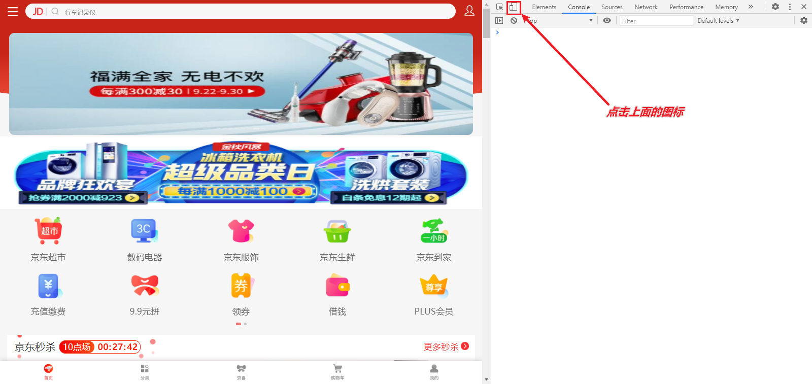
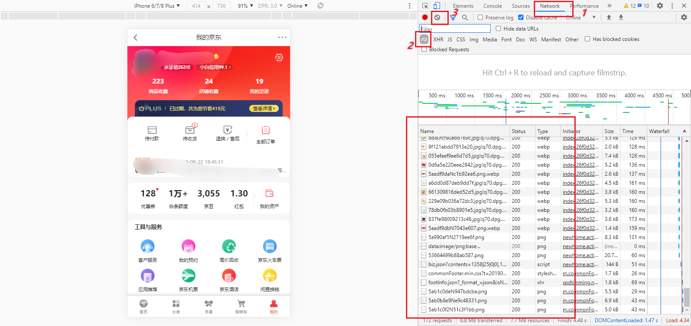
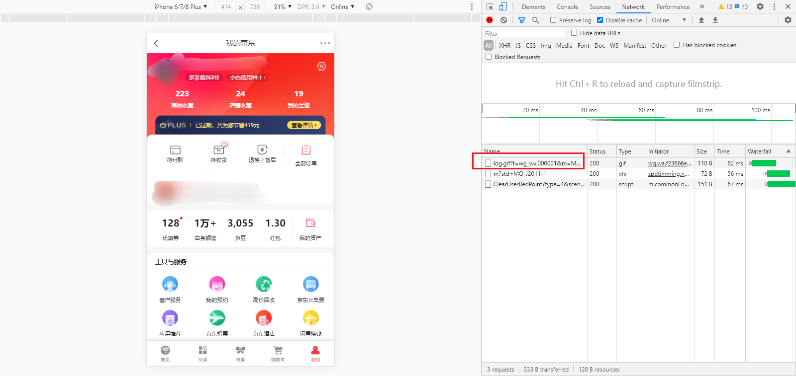
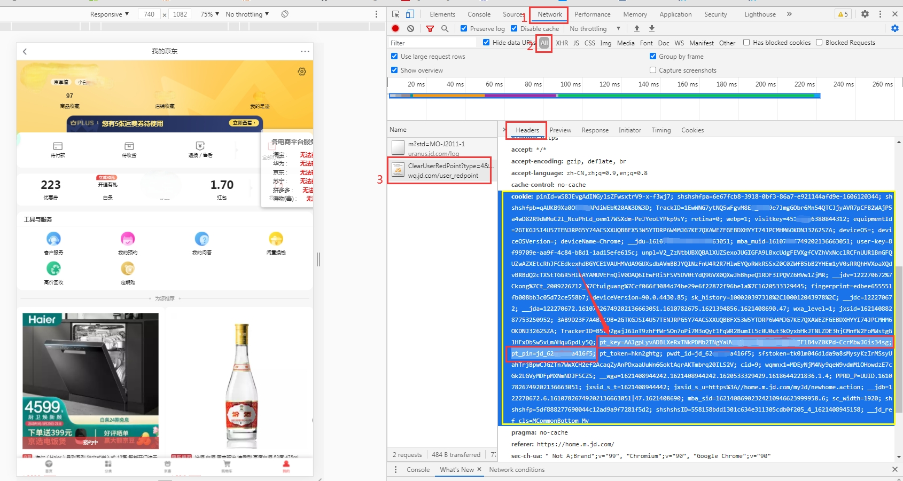

## 浏览器获取京东cookie教程

 **以下浏览器都行**

 - Chrome浏览器
 - 新版Edge浏览器
 - 国产360，QQ浏览器切换到极速模式
 - 其他浏览器..

### 操作步骤

1. 电脑浏览器打开京东网址 [https://m.jd.com/](https://m.jd.com/)
2. 按键盘F12键打开开发者工具，然后点下图中的图标
 
3. 此时是未登录状态(使用手机短信验证码登录)，如已登录请忽略此步骤
     - 使用手机短信验证码登录(此方式cookie有效时长大概31天，其他登录方式比较短)
4. 登录后，选择Network,有很多链接的话点箭头这里清空下
    
5. 然后再点我的，链接就变少了
    
6. 找到cookie，如图上的代码  复制出来，下面需要用到
 
7. 第六步复制出来的cookie比较长，我们只需要`pt_pin=xxxx;`和 `pt_key=xxxx;`部分的内容即可(注:英文引号`;`是必要的)。> 可以用下面的脚本（可以无视），在Chrome浏览器按F12，console里面输入下面脚本按enter回车键
    ```
    var CV = '单引号里面放第六步拿到的cookie';
    var CookieValue = CV.match(/pt_pin=.+?;/) + CV.match(/pt_key=.+?;/);
    copy(CookieValue);
    ```
按照以下格式形成自己的jd_cookie
      - `pt_key=xxxxxxxxxxxxxxxx;pt_pin=xxxxxxxxxxxxxx;` ,后面的英文引号`;`是必须要的
      - 给一个京东cookie具体示例 `pt_key=jdDC2F833333EFDGTCE5BD4AD1A952D4F4DF8446052;pt_pin=jd_123456;`      

在`Settings`-`Secrets`里面添加`JD_COOKIE`
     

8. 注意：如果需获取第二个京东账号的cookie,不要在刚才的浏览器上面退出登录账号一(否则刚才获取的cookie会失效),需另外换一个浏览器(Chrome浏览器 `ctr+shift+n` 打开无痕模式也行),然后继续按上面步骤操作即可  
   注意：如果需获取第二个京东账号的cookie,不要在刚才的浏览器上面退出登录账号一(否则刚才获取的cookie会失效),需另外换一个浏览器(Chrome浏览器 `ctr+shift+n` 打开无痕模式也行),然后继续按上面步骤操作即可  
   注意：如果需获取第二个京东账号的cookie,不要在刚才的浏览器上面退出登录账号一(否则刚才获取的cookie会失效),需另外换一个浏览器(Chrome浏览器 `ctr+shift+n` 打开无痕模式也行),然后继续按上面步骤操作即可  

- 多条 cookie 用&隔开，支持无数条 cookie
     

#### 其他教程

 + [插件获取京东cookie教程](/readme/backup/GetJdCookie2.md) 